# backend-admin

NestJS REST API for the Jawab admin platform. **Port 3001**, PostgreSQL via Prisma (`db_jawab`), Redis required for the email queue/cache.

## Setup

```bash
npm install
createdb db_jawab
cp .env.example .env          # set DATABASE_URL etc.
npx prisma migrate dev        # create tables
npm run seed                  # creates admin@jawab.com / Admin@123 (+ 3 other roles)
npm run start:dev             # http://localhost:3001/api, docs at /api/docs
```

## Database & Relations

Full schema: `prisma/schema.prisma` (33 models, PostgreSQL). Every table has `id`, `created_at`/`updated_at`, and plain-`Int` audit columns `created_by`/`updated_by` (not real FKs). No cascade deletes are declared anywhere.

```mermaid
erDiagram
    User {
        int id PK
        UserRole role
        string username
        string email
        string password_hash
        AuthType auth_type
        boolean is_active
        boolean is_verified
        boolean is_deleted
    }
    UserProfile {
        int id PK
        int user_id FK
        string full_name
        string profile_picture
        ProfileGender profile_gender
        date profile_birthday
    }
    UserVerification {
        int id PK
        int user_id FK
        string verification_code
        datetime expires_at
        boolean is_used
    }
    UserPasswordReset {
        int id PK
        int user_id FK
        string reset_code
        datetime expires_at
        boolean is_used
    }
    UserDevice {
        int id PK
        int user_id FK
        string device_id
        DeviceType device_type
        string device_token
    }
    UserTopic {
        int id PK
        int user_id FK
        int topic_id FK
    }
    UserFollower {
        int id PK
        int user_id FK "the one being followed"
        int follower_id FK "the one following"
    }
    CommunityUser {
        int id PK
        int community_id FK
        int user_id FK
        CommunityUserRole role
    }
    Topic {
        int id PK
        int parent_id "self-ref, not a real FK"
        string topic_slug
        string topic_name
        boolean is_active
    }
    Community {
        int id PK
        string community_slug
        string community_name
        boolean is_active
    }
    CommunityTopic {
        int id PK
        int community_id FK
        int topic_id FK
    }
    UserPost {
        int id PK
        int user_id FK
        int post_topic_id FK
        string post_slug
        string post_title
        string post_content
        PostStatus post_status
        PostType post_type
        int like_count
        int comment_count
        int view_count
    }
    PostLike {
        int id PK
        int post_id FK
        int user_id
        LikeStatus like_status
    }
    PostComment {
        int id PK
        int post_id FK
        int user_id FK
        int parent_comment_id FK "self-ref, threaded replies"
        string comment_content
        boolean is_approved
    }
    CommentLike {
        int id PK
        int comment_id FK
        int user_id
        LikeStatus like_status
    }
    UserPoll {
        int id PK
        int user_id FK
        string poll_slug
        string poll_title
        string poll_description
        PollStatus poll_status
        int vote_count
    }
    PollOption {
        int id PK
        int poll_id FK
        string option_text
        int vote_count
    }
    PollVote {
        int id PK
        int poll_id FK
        int user_id
        int vote_option_id FK
    }
    PollLike {
        int id PK
        int poll_id FK
        int user_id
        LikeStatus like_status
    }
    PollComment {
        int id PK
        int poll_id FK
        int user_id FK
        int parent_comment_id FK "self-ref, threaded replies"
        string comment_content
    }
    Currency {
        int id PK
        string currency_name
        string currency_code
        string currency_symbol
    }
    Subscription {
        int id PK
        SubscriptionType subscription_type
        string subscription_name
        decimal subscription_price
        int currency_id FK
    }
    UserSubscription {
        int id PK
        int user_id
        int subscription_id FK
        SubscriptionStatus subscription_status
        datetime subscription_end_date
    }
    Payment {
        int id PK
        int users_subscriptions_id FK
        int user_id FK
        decimal payment_amount
        PaymentStatus payment_status
        PaymentMethod payment_method
        int currency_id FK
    }
    Email {
        int id PK
        EmailType email_type
        string recipient_email
        EmailStatus status
    }
    Notification {
        int id PK
        int user_id
        NotificationType notification_type
        string title
        boolean is_read
        int email_id FK
    }
    Job {
        int id PK
        JobType job_type
        JobStatus job_status
        int notification_id FK
        int email_id FK
    }

    User ||--o| UserProfile : has
    User ||--o{ UserVerification : has
    User ||--o{ UserPasswordReset : has
    User ||--o{ UserDevice : has
    User ||--o{ UserTopic : follows
    User ||--o{ UserFollower : "is followed by"
    User ||--o{ UserFollower : follows
    User ||--o{ CommunityUser : joins
    User ||--o{ UserPost : writes
    User ||--o{ PostComment : writes
    User ||--o{ UserPoll : writes
    User ||--o{ PollComment : writes
    User ||--o{ Payment : pays

    Topic ||--o{ UserPost : categorizes
    Topic ||--o{ CommunityTopic : "tagged in"

    Community ||--o{ CommunityTopic : has
    Community ||--o{ CommunityUser : "has members"

    UserPost ||--o{ PostLike : has
    UserPost ||--o{ PostComment : has
    PostComment ||--o{ CommentLike : has
    PostComment ||--o{ PostComment : "replies to"

    UserPoll ||--o{ PollOption : has
    UserPoll ||--o{ PollVote : has
    UserPoll ||--o{ PollLike : has
    UserPoll ||--o{ PollComment : has
    PollOption ||--o{ PollVote : receives
    PollComment ||--o{ PollComment : "replies to"

    Currency ||--o{ Subscription : "priced in"
    Currency ||--o{ Payment : "paid in"
    Subscription ||--o{ UserSubscription : "purchased as"
    UserSubscription ||--o{ Payment : "billed by"

    Email ||--o{ Notification : "attached to"
    Email ||--o{ Job : processes
    Notification ||--o{ Job : processes
```



Standalone, no relations: `Banner`, `AppSetting`, `Media`, `PrivacyPolicy`, `Support`, `Template`.

Soft delete (`is_deleted`/`deleted_at`) exists **only** on `User`; everything else is hard-delete.

Browse it live: `npx prisma studio`.

## API

Base URL `http://localhost:3001/api`. Two audiences behind the same JWT (`Authorization: Bearer <token>`):
- `ma/*` — end-user self-service (profile, follow, topics)
- `admin/*` — admin/sub_admin only (users, content moderation, subscriptions, dashboard stats, export)

Full endpoint-by-endpoint reference is generated live at **`/api/docs`** (Swagger) — not duplicated here.

## Modules (`src/modules/`)

| Module | Description |
|---|---|
| `admin` | Fat module — dashboard stats, cross-module moderation |
| `auth` | JWT, OAuth (Google/Apple), email verification |
| `user`, `post`, `comment`, `poll`, `community`, `general` (topics) | Core content |
| `subscription`, `currency`, `entitlements` | Monetization |
| `notification`, `email`, `templates`, `job` | Async/comms (BullMQ-backed) |
| `media` | Uploads, image optimization, local/S3 storage |
| `banner`, `app-settings`, `privacy-policy`, `support`, `search` | Static/admin content |
| `shared` | `@Global()` — `MediaClientService`, `RedisService` |
