# backend-admin

NestJS REST API for the Jawab admin platform. **Port 3001**, PostgreSQL via Prisma (`db_jawab`), Redis required for the email queue/cache.

## Setup

```bash
npm install
createdb db_jawab
cp .env.example .env          # set DATABASE_URL etc.
npx prisma migrate dev        # create tables
npm run seed                  # creates admin@jawab.com / Admin@123 (+ 3 other roles)
npm run start:dev             # http://localhost:3001/api, docs at /api/docs
```

## Database & Relations

Full schema: `prisma/schema.prisma` (35 models, PostgreSQL). Every table has `id`, `created_at`/`updated_at`, and plain-`Int` audit columns `created_by`/`updated_by` (not real FKs). No cascade deletes are declared anywhere.

```mermaid
erDiagram
    User {
        int id PK
        UserRole role
        string username
        string email
        string password_hash
        AuthType auth_type
        boolean is_active
        boolean is_verified
        boolean is_deleted
    }
    UserProfile {
        int id PK
        int user_id FK
        string full_name
        string profile_picture
        ProfileGender profile_gender
        date profile_birthday
    }
    UserVerification {
        int id PK
        int user_id FK
        string verification_code
        datetime expires_at
        boolean is_used
    }
    UserPasswordReset {
        int id PK
        int user_id FK
        string reset_code
        datetime expires_at
        boolean is_used
    }
    UserDevice {
        int id PK
        int user_id FK
        string device_id
        DeviceType device_type
        string device_token
    }
    UserTopic {
        int id PK
        int user_id FK
        int topic_id FK
    }
    UserFollower {
        int id PK
        int user_id FK "the one being followed"
        int follower_id FK "the one following"
    }
    CommunityUser {
        int id PK
        int community_id FK
        int user_id FK
        CommunityUserRole role
    }
    Topic {
        int id PK
        int parent_id "self-ref, not a real FK"
        string topic_slug
        string topic_name
        boolean is_active
    }
    Community {
        int id PK
        string community_slug
        string community_name
        boolean is_active
    }
    CommunityTopic {
        int id PK
        int community_id FK
        int topic_id FK
    }
    UserPost {
        int id PK
        int user_id FK
        int post_topic_id FK
        string post_slug
        string post_title
        string post_content
        PostStatus post_status
        PostType post_type
        int like_count
        int comment_count
        int view_count
    }
    PostLike {
        int id PK
        int post_id FK
        int user_id
        LikeStatus like_status
    }
    PostComment {
        int id PK
        int post_id FK
        int user_id FK
        int parent_comment_id FK "self-ref, threaded replies"
        string comment_content
        boolean is_approved
    }
    CommentLike {
        int id PK
        int comment_id FK
        int user_id
        LikeStatus like_status
    }
    UserPoll {
        int id PK
        int user_id FK
        string poll_slug
        string poll_title
        string poll_description
        PollStatus poll_status
        int vote_count
    }
    PollOption {
        int id PK
        int poll_id FK
        string option_text
        int vote_count
    }
    PollVote {
        int id PK
        int poll_id FK
        int user_id
        int vote_option_id FK
    }
    PollLike {
        int id PK
        int poll_id FK
        int user_id
        LikeStatus like_status
    }
    PollComment {
        int id PK
        int poll_id FK
        int user_id FK
        int parent_comment_id FK "self-ref, threaded replies"
        string comment_content
    }
    Currency {
        int id PK
        string currency_name
        string currency_code
        string currency_symbol
    }
    Subscription {
        int id PK
        SubscriptionType subscription_type
        string subscription_name
        decimal subscription_price
        int currency_id FK
    }
    UserSubscription {
        int id PK
        int user_id
        int subscription_id FK
        SubscriptionStatus subscription_status
        datetime subscription_end_date
    }
    Payment {
        int id PK
        int users_subscriptions_id FK
        int user_id FK
        decimal payment_amount
        PaymentStatus payment_status
        PaymentMethod payment_method
        int currency_id FK
    }
    Email {
        int id PK
        EmailType email_type
        string recipient_email
        EmailStatus status
    }
    Sms {
        int id PK
        string phone_number
        SmsType sms_type
        string message
        SmsStatus status
    }
    PointsTransaction {
        int id PK
        int user_id FK
        int points
        PointsReason reason
        int related_id "not a real FK, polymorphic"
    }
    Notification {
        int id PK
        int user_id
        NotificationType notification_type
        string title
        boolean is_read
        int email_id FK
    }
    Job {
        int id PK
        JobType job_type
        JobStatus job_status
        int notification_id FK
        int email_id FK
    }

    User ||--o| UserProfile : has
    User ||--o{ UserVerification : has
    User ||--o{ UserPasswordReset : has
    User ||--o{ UserDevice : has
    User ||--o{ UserTopic : follows
    User ||--o{ UserFollower : "is followed by"
    User ||--o{ UserFollower : follows
    User ||--o{ CommunityUser : joins
    User ||--o{ UserPost : writes
    User ||--o{ PostComment : writes
    User ||--o{ UserPoll : writes
    User ||--o{ PollComment : writes
    User ||--o{ Payment : pays
    User ||--o{ PointsTransaction : earns

    Topic ||--o{ UserPost : categorizes
    Topic ||--o{ CommunityTopic : "tagged in"

    Community ||--o{ CommunityTopic : has
    Community ||--o{ CommunityUser : "has members"

    UserPost ||--o{ PostLike : has
    UserPost ||--o{ PostComment : has
    PostComment ||--o{ CommentLike : has
    PostComment ||--o{ PostComment : "replies to"

    UserPoll ||--o{ PollOption : has
    UserPoll ||--o{ PollVote : has
    UserPoll ||--o{ PollLike : has
    UserPoll ||--o{ PollComment : has
    PollOption ||--o{ PollVote : receives
    PollComment ||--o{ PollComment : "replies to"

    Currency ||--o{ Subscription : "priced in"
    Currency ||--o{ Payment : "paid in"
    Subscription ||--o{ UserSubscription : "purchased as"
    UserSubscription ||--o{ Payment : "billed by"

    Email ||--o{ Notification : "attached to"
    Email ||--o{ Job : processes
    Notification ||--o{ Job : processes
```



Standalone, no relations: `Banner`, `AppSetting`, `Media`, `PrivacyPolicy`, `Support`, `Template`, `Sms`.

Soft delete (`is_deleted`/`deleted_at`) exists **only** on `User`; everything else uses an `is_active` flag instead (or is hard-deleted, e.g. `deletePost`/`deletePoll`/`deleteComment`-without-replies).

**Points award total** (`UserProfile.total_points`) is denormalized and kept in sync by `PointsService.award()` alongside each `PointsTransaction` insert — see [`../PROJECT_REQUIREMENTS.md`](../PROJECT_REQUIREMENTS.md#56-monetization-subscription-payment-currency-points-entitlements).

**Known schema debt** (see the requirements doc §4.2/§8 for the full list): `community_ids`/`post_tags` on `UserPost`/`UserPoll` and all `Banner` targeting fields are comma-separated strings, not real join tables — `CommunityTopic` is the one relation here that *is* a proper join table. `Template`/`Job` models exist but have no live code path writing to them (dead schema, kept for now — see requirements doc §5.7/§8.4 before building against them).

Browse it live: `npx prisma studio`.

## API

Base URL `http://localhost:3001/api`. Two audiences behind the same JWT (`Authorization: Bearer <token>`), gated per-controller (not globally):
- `ma/*` — the mobile/consumer app's entire surface: auth, profile, follow, topic subscriptions, **and all content creation/browsing** (posts, comments, polls, communities, feed, search, banners-for-you, points, entitlements).
- `admin/*` — `admin`/`sub_admin` only (enforced by `RolesGuard`, plus an admin-only login path in `AdminService.login`): user/content moderation, dashboard analytics, subscription/payment/currency management, CSV-style export (JSON payload — no server-side CSV library; the frontend renders the file).

Full endpoint-by-endpoint reference is generated live at **`/api/docs`** (Swagger) — not duplicated here. Business rules, state machines, and known gaps per module are documented in [`../PROJECT_REQUIREMENTS.md`](../PROJECT_REQUIREMENTS.md#5-backend-functional-requirements).

A runnable Postman collection covering every `ma/*` and `admin/*` endpoint (with auto-captured tokens/IDs) lives in [`postman/`](../postman/) at the repo root (gitignored local only, not committed).

## Modules (`src/modules/`)

| Module | Description |
|---|---|
| `admin` | Fat module — dashboard stats/user-growth, user & content moderation, global search, export. Delegates to domain services (subscription, general, community) where they exist |
| `auth` | JWT (30d access / 90d refresh, stored on `User` row), Google/Apple OAuth (manual verification, not Passport strategies), email/SMS verification, forgot/reset password |
| `user` | Self-service profile (avatar/background upload), follow/unfollow, topic subscriptions |
| `post`, `comment`, `poll`, `community`, `general` (topics) | Core content, all `ma/*`. `general` is the only module with true global-RBAC-gated writes (`RolesGuard`); the rest use inline ownership/membership checks |
| `feed`, `search` | Aggregation/read layer — feed composition + Redis caching + banner injection; unified cross-entity search |
| `subscription`, `currency`, `entitlements` | Monetization — plan catalog + user subscriptions + self-reported payments (no real payment-gateway integration), feature-gating (`FeatureGuard`) + daily quotas (`QuotaService`), both Redis-backed |
| `points` | Gamification — fixed-amount awards on question/poll/answer creation only, denormalized lifetime total + append-only ledger |
| `notification`, `email`, `sms`, `templates`, `job` | Async/comms. Email is BullMQ-backed but queueing is **disabled by default** (sends inline); push notifications and the generic `Job` ledger are schema-only, not implemented; `templates` has a live file-based Handlebars path and a separate DB-backed `Template`/`PdfService` path that is dead code |
| `media` | Uploads, Sharp image optimization (WebP/AVIF), ffmpeg video thumbnails, local disk or S3 storage (`cloudinary` is declared but unimplemented) |
| `banner`, `app-settings`, `privacy-policy`, `support` | Static/admin content — `privacy-policy`/`support` are singleton records (create blocked once one exists), `app-settings` is a generic key/value store (its GET routes are currently unauthenticated) |
| `shared` | `@Global()` — exports `MediaClientService` (thin wrapper so other modules don't need to import `MediaModule` directly) and `RedisService` |
